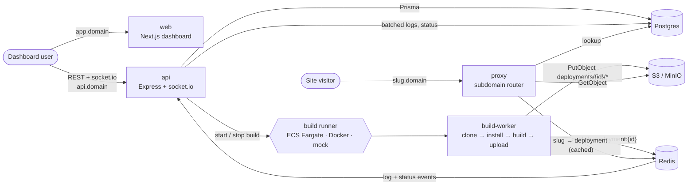

# One-step deployment

Deploy a static site or single-page app from a public GitHub repository in one step, then serve it at
`https://{slug}.{your-domain}`. A Vercel-style platform in a TypeScript monorepo: email login,
projects, isolated builds with live logs, deployment history and instant rollback.

## Architecture



- **api**: auth, projects, deployments, the build runner, event ingestion, socket.io and metrics.
  Routes call services, services call repositories. Status changes follow a strict state machine:
  QUEUED → BUILDING → UPLOADING → READY, or FAILED / CANCELED.
- **build-worker**: one container per deployment. It has **no database credentials**. It only
  holds Redis and write access to `deployments/*`. Commands run from argument arrays (never a shell),
  with a timeout and an output limit, and upload paths are sanitized.
- **proxy**: resolves `{slug}.{ROOT_DOMAIN}` to the project's current READY deployment and streams
  files from storage. It falls back to `index.html` for SPAs and serves a 404 page for unknown slugs.
- **web**: dashboard with a terminal-style log viewer. The viewer loads persisted logs, then tails
  live over socket.io.

```
apps/        api, build-worker, proxy, web
packages/    config (zod env), shared (DTOs, events, logger, http), db (Prisma), storage (S3/MinIO),
             tsconfig, eslint-config
infra/       docker-compose.yml, monitoring/ (Prometheus + Grafana), aws/ (ECS, IAM, EC2 + Caddy)
e2e/         Playwright happy path
```

## Local setup

Requires Node 22, pnpm 10 and Docker.

```sh
pnpm install
pnpm setup:env                    # creates .env files from the examples (never overwrites)
pnpm infra:up && pnpm db:migrate  # postgres, redis, minio + schema
pnpm stack:up                     # builds and starts api, proxy, web and the build-worker image
open http://localhost:3000
```

Login codes are printed in the api log (`docker compose --env-file .env -f infra/docker-compose.yml logs api`).
Deployed sites are served at `http://{slug}.localhost:8000`. On Linux, set `DOCKER_GID` in `.env` to
`stat -c %g /var/run/docker.sock` so the api container can start build containers.

**Hot reload:** run `pnpm dev`, which starts api, proxy and web from source with their `.env` files.
For UI work without Docker builds, set `BUILD_RUNNER=mock` in `apps/api/.env`. Builds are then
simulated, but still go through Redis, the ingestor and socket.io.

**Monitoring:** `pnpm monitoring:up` adds Prometheus (`:9090`) and Grafana (`:3001`, user `admin`,
password `GRAFANA_ADMIN_PASSWORD`). Grafana comes with a provisioned dashboard covering traffic,
latency, errors, deployments by status and build duration.

| Service    | Port | Health                            |
| ---------- | ---- | --------------------------------- |
| web        | 3000 | `/login`                          |
| api        | 4000 | `/healthz`, `/readyz`, `/metrics` |
| proxy      | 8000 | `/healthz`, `/readyz`, `/metrics` |
| minio      | 9000 | console on 9001                   |
| prometheus | 9090 |                                   |
| grafana    | 3001 |                                   |

### Tests

```sh
pnpm lint && pnpm typecheck && pnpm build
pnpm test        # unit + integration; needs DATABASE_URL and REDIS_URL (pnpm infra:up)
pnpm test:e2e    # Playwright: login → create project → deploy → live logs (see e2e/README.md)
```

CI runs install, format, lint, typecheck, migrate, test and build, then the Playwright job and a
Docker build of every image.

## Environment reference

Every service validates its environment with zod (`packages/config`) and refuses to start on a
missing or invalid value. The checked-in `.env.example` files are the full reference, and a test
keeps them valid.

| Variable                                                         | Used by                    | Notes                                                                                                                                                                 |
| ---------------------------------------------------------------- | -------------------------- | --------------------------------------------------------------------------------------------------------------------------------------------------------------------- |
| `NODE_ENV`, `LOG_LEVEL`                                          | all                        | JSON logs; pretty in development                                                                                                                                      |
| `DATABASE_URL`                                                   | api, proxy                 | Postgres. Never given to the worker                                                                                                                                   |
| `REDIS_URL`                                                      | api, proxy, worker         | Must include a password (`redis://:pass@host:6379`, or `rediss://`)                                                                                                   |
| `STORAGE_DRIVER`                                                 | api, proxy, worker         | `s3` (AWS credential chain + `AWS_REGION`) or `minio` (`S3_*` keys)                                                                                                   |
| `STORAGE_BUCKET`                                                 | api, proxy, worker         | Sites live under `deployments/{deploymentId}/`                                                                                                                        |
| `S3_ENDPOINT`, `S3_ACCESS_KEY_ID`, `S3_SECRET_ACCESS_KEY`        | minio only                 | Local S3-compatible storage                                                                                                                                           |
| `WEB_ORIGIN`                                                     | api                        | Only origin allowed by CORS and socket.io                                                                                                                             |
| `ROOT_DOMAIN`, `SITE_URL_TEMPLATE`                               | api, proxy                 | Sites at `{slug}.{ROOT_DOMAIN}`; template overrides the shown URL                                                                                                     |
| `JWT_SECRET`, `JWT_TTL_SECONDS`                                  | api                        | Session cookie (httpOnly, SameSite=Lax); secret ≥ 32 chars                                                                                                            |
| `COOKIE_SECURE`, `COOKIE_DOMAIN`, `TRUST_PROXY`                  | api (proxy: `TRUST_PROXY`) | Secure cookies in production; trust Caddy's forwarded headers                                                                                                         |
| `EMAIL_DRIVER`                                                   | api                        | `console` (logs the code) or `resend` (`RESEND_API_KEY`, `EMAIL_FROM`)                                                                                                |
| `BUILD_RUNNER`                                                   | api                        | `ecs` (`ECS_*`, `AWS_REGION`), `docker` (`BUILD_WORKER_IMAGE`, `DOCKER_NETWORK`, `WORKER_*`) or `mock` (not in production)                                            |
| `BUILD_TIMEOUT_MS`, `MAX_CONCURRENT_BUILDS_PER_USER`             | api, worker                | Default 10 minutes and 2 builds                                                                                                                                       |
| `GUEST_LOGIN_ENABLED`, `GUEST_TTL_SECONDS`, `GUEST_MAX_PROJECTS` | api                        | "Login as guest" creates a throwaway account; after the TTL (default 24h) it is deleted with its projects, deployments, logs and files. Guests get at most 3 projects |
| `MAX_OUTPUT_BYTES`, `WORK_DIR`                                   | worker                     | Output size limit and scratch directory                                                                                                                               |
| `DEPLOYMENT_ID`, `GIT_URL`, `REQUEST_ID`                         | worker                     | Injected per build by the runner                                                                                                                                      |
| `CACHE_TTL_SECONDS`                                              | proxy                      | Slug → deployment cache in Redis                                                                                                                                      |
| `METRICS_TOKEN`                                                  | api, proxy                 | When set, `/metrics` requires `Authorization: Bearer <token>`                                                                                                         |
| `NEXT_PUBLIC_API_URL`, `NEXT_PUBLIC_ROOT_DOMAIN`                 | web                        | Inlined at build time (Docker build args)                                                                                                                             |

## Deploying to AWS

The production layout is a single EC2 host running Caddy, web, api, proxy and Redis, plus S3 for
sites, RDS for Postgres, and ECS Fargate for builds. The templates in `infra/aws/` use
`${PLACEHOLDERS}`; render them with your values first:

```sh
export AWS_ACCOUNT_ID=123456789012 AWS_REGION=ap-south-1 BUCKET=my-osd-sites ECS_CLUSTER=osd \
       HOSTED_ZONE_ID=Z0123456789 IMAGE_TAG=v1 DOMAIN=example.dev
node infra/aws/render.mjs     # → infra/aws/out/{iam,ecs,s3}/*.json
```

**1. S3 bucket (private, TLS-only)**

```sh
aws s3api create-bucket --bucket $BUCKET --create-bucket-configuration LocationConstraint=$AWS_REGION
aws s3api put-public-access-block --bucket $BUCKET --public-access-block-configuration \
  BlockPublicAcls=true,IgnorePublicAcls=true,BlockPublicPolicy=true,RestrictPublicBuckets=true
aws s3api put-bucket-policy --bucket $BUCKET --policy file://infra/aws/out/s3/bucket-policy.json
```

**2. ECR images**

```sh
REGISTRY=$AWS_ACCOUNT_ID.dkr.ecr.$AWS_REGION.amazonaws.com
aws ecr get-login-password | docker login --username AWS --password-stdin $REGISTRY
for app in api proxy web build-worker; do
  aws ecr create-repository --repository-name osd/$app --image-scanning-configuration scanOnPush=true
done
for app in api proxy build-worker; do
  docker build -f apps/$app/Dockerfile -t $REGISTRY/osd/$app:$IMAGE_TAG . && docker push $REGISTRY/osd/$app:$IMAGE_TAG
done
docker build -f apps/web/Dockerfile --build-arg NEXT_PUBLIC_API_URL=https://api.$DOMAIN \
  --build-arg NEXT_PUBLIC_ROOT_DOMAIN=$DOMAIN -t $REGISTRY/osd/web:$IMAGE_TAG . && docker push $REGISTRY/osd/web:$IMAGE_TAG
docker build -f apps/api/Dockerfile --target migrate -t $REGISTRY/osd/migrate:$IMAGE_TAG . && docker push $REGISTRY/osd/migrate:$IMAGE_TAG
```

**3. IAM roles (least privilege)**

| Role                                | Trust       | Policy                                    | Grants                                                                                              |
| ----------------------------------- | ----------- | ----------------------------------------- | --------------------------------------------------------------------------------------------------- |
| `osd-build-worker-task`             | `ecs-tasks` | `build-worker-task-role.policy.json`      | `s3:PutObject` on `$BUCKET/deployments/*` only                                                      |
| `osd-build-worker-execution`        | `ecs-tasks` | `build-worker-execution-role.policy.json` | Pull the worker image, write its logs, read the Redis URL param                                     |
| `osd-app-server` (instance profile) | `ec2`       | `app-server.policy.json`                  | RunTask/StopTask on the worker, PassRole, read and delete `deployments/*`, Route53 DNS-01 for Caddy |

```sh
cd infra/aws/out/iam
aws iam create-role --role-name osd-build-worker-task --assume-role-policy-document file://ecs-tasks.trust.json
aws iam put-role-policy --role-name osd-build-worker-task --policy-name s3-upload --policy-document file://build-worker-task-role.policy.json
aws iam create-role --role-name osd-build-worker-execution --assume-role-policy-document file://ecs-tasks.trust.json
aws iam put-role-policy --role-name osd-build-worker-execution --policy-name execution --policy-document file://build-worker-execution-role.policy.json
aws iam create-role --role-name osd-app-server --assume-role-policy-document file://ec2.trust.json
aws iam put-role-policy --role-name osd-app-server --policy-name app --policy-document file://app-server.policy.json
aws iam create-instance-profile --instance-profile-name osd-app-server
aws iam add-role-to-instance-profile --instance-profile-name osd-app-server --role-name osd-app-server
cd -
```

**4. Network, database and secrets**

- **Security groups:**
  - `sg-app`: 80 and 443 from anywhere, and 22 from your IP.
  - `sg-build-workers`: no inbound rules. Egress is needed for git and npm.
  - `sg-app` also allows 6379 from `sg-build-workers`, so builds can publish to Redis.
- **RDS for PostgreSQL 16:** in the same VPC, allowing 5432 from `sg-app` only.
- **Redis URL for the workers:** store the URL (using the EC2 private IP) as a SecureString parameter:
  `aws ssm put-parameter --name /osd/worker/REDIS_URL --type SecureString --value "redis://:$REDIS_PASSWORD@10.0.1.10:6379"`.

**5. ECS cluster and task definition**

```sh
aws ecs create-cluster --cluster-name $ECS_CLUSTER
aws logs create-log-group --log-group-name /ecs/osd-build-worker
aws logs put-retention-policy --log-group-name /ecs/osd-build-worker --retention-in-days 14
aws ecs register-task-definition --cli-input-json file://infra/aws/out/ecs/build-worker.task-definition.json
```

**6. EC2 host with Caddy (wildcard domain)**

1. Launch Amazon Linux 2023 in a public subnet with `sg-app`, the `osd-app-server` instance
   profile and an Elastic IP.
2. In Route53, point `$DOMAIN` and `*.$DOMAIN` (A records) at the Elastic IP.
3. On the host, install Docker and the compose plugin, then copy `infra/aws/ec2/`.
4. Create `.env`, `api.env` and `proxy.env` from the examples. Set `BUILD_RUNNER=ecs`, the `ECS_*`
   subnets and `sg-build-workers`, `STORAGE_DRIVER=s3`, `EMAIL_DRIVER=resend`, and a `METRICS_TOKEN`.
5. Run migrations and start the stack:

```sh
aws ecr get-login-password | docker login --username AWS --password-stdin $REGISTRY
docker run --rm --env-file api.env $REGISTRY/osd/migrate:$IMAGE_TAG
docker compose up -d --build     # builds Caddy with the Route53 DNS module, then starts everything
```

Caddy gets one wildcard certificate over the DNS-01 challenge. It routes `app.$DOMAIN` to web,
`api.$DOMAIN` to api (with `/metrics` blocked), and every other subdomain to the proxy. `app` and
`api` are reserved slugs, so a project can never claim them.

**7. Verify.** Open `https://app.$DOMAIN`, sign in, create a project and deploy. Check
`/ecs/osd-build-worker` in CloudWatch if a build fails to start.

To upgrade, push images with a new `IMAGE_TAG`, register a new task definition revision, run the
migrate image, then run `docker compose up -d`.

## Security notes

- Only `https://github.com/<owner>/<repo>` URLs are accepted. Slugs are validated, and reserved
  names are blocked.
- Login codes are hashed, expire after 10 minutes, and allow 5 attempts. Rate limits apply per
  email and per IP.
- Every request is validated with zod. The api uses helmet, strict CORS, body size limits, and error
  responses without stack traces. Every project and deployment route checks ownership, and so do
  socket.io rooms.
- Builds run with a clean environment (no credentials besides Redis) under CPU, memory, time and
  output limits. Locally, the Docker runner mounts the Docker socket into the api. That is
  root-equivalent, so it is for development only.

## Known limitations

- The api runs as a single instance. Worker events use Redis pub/sub, so events published while the
  api is down are lost. The stale-build sweeper then fails those builds.
- Only public GitHub repositories are supported. There are no build environment variables or custom
  domains yet.
